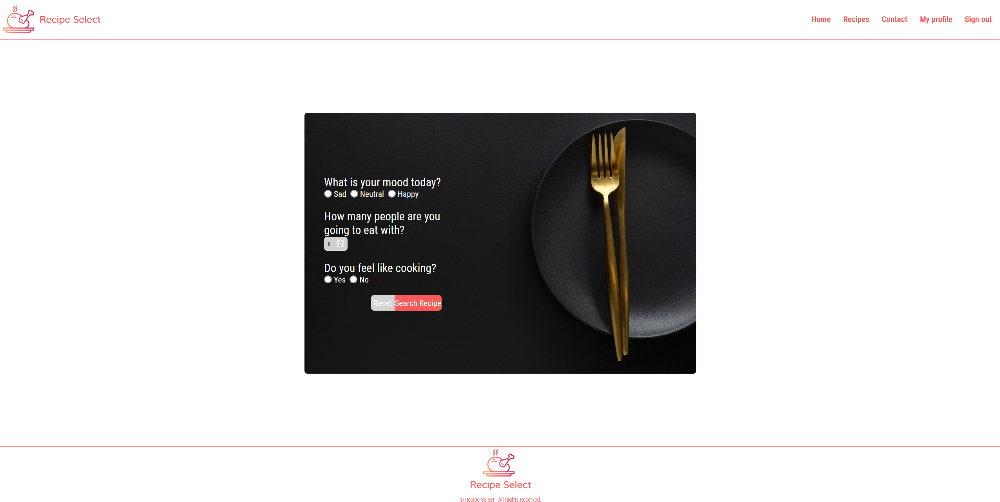
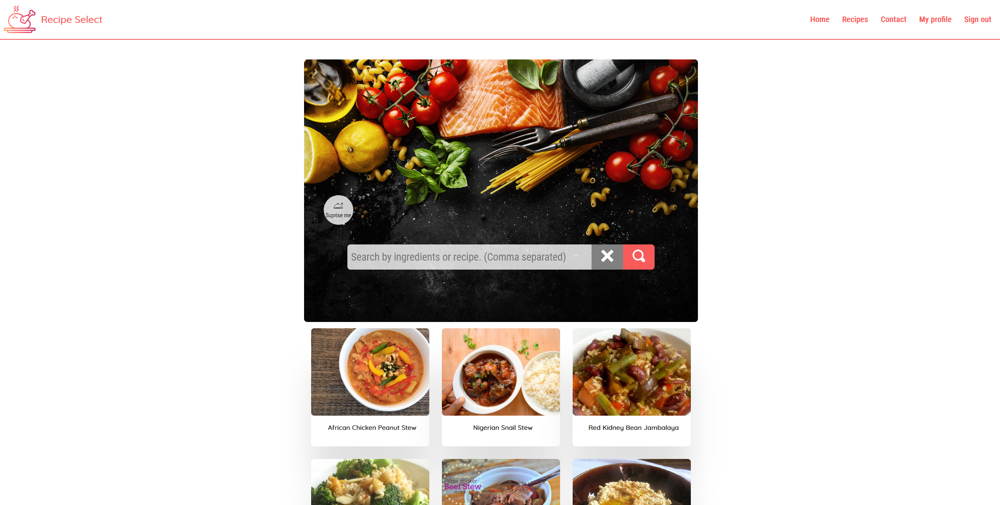

# Installatiehandleiding

De volgende twee programma's moeten geïnstalleerd worden:

    * Webstorm
    * NodeJS

## NodeJs

Stap 1: Ga naar https://nodejs.org/en/ \
Stap 2: Klik op het groene bloekje met "18.5.0 Current". De download wordt gestart.\
Stap 3: Ga naar uw "Download" map in uw "Verkenner". Hier vind u uw node-v18.5.0-x64.msi terug. Dubbelklik op het bestand om de installatie te starten.\
Stap 4: Het NodeJs Setup is geopend. Klik op "Next".\
Stap 5: Vink "I accept the terms in the License Agreement" aan. Klik daarna op "Next". \
Stap 6: Klik nogmaals op "Next". Deze instelling staan automatisch goed. \
Stap 7: Klik nogmaals op "Next". Deze instelling staan automatisch goed. \
Stap 8: Klik nogmaals op "Next". Deze instelling staan automatisch goed. \
Stap 9: Klik op "Install". NodeJs wordt nu geïnstalleerd. Wacht tot de statusbalk 100%. \
Stap 10: De installatie is voltooid. Klik op "Finish".\

## Webstorm

Stap 1: Ga naar https://www.jetbrains.com/webstorm/ \
Stap 2: Klik op de "Download" knop. Vervolgens start de browser een download van het webstorm applicaties.\
Stap 3: Ga naar uw "Download" map in uw "Verkenner". Hier vind u uw Webstorm-2022.1.3.exe terug. Dubbelklik op het bestand om de installatie te starten.\
Stap 4: Het WebStorm Setup is geopend. Klik op "Next".\
Stap 5: Klik nogmaals op "Next". Deze instelling staan automatisch goed. \
Stap 6: Klik nogmaals op "Next". Deze instelling staan automatisch goed. \
Stap 7: Klik op "Install". Deze instelling staan automatisch goed. Webstorm wordt nu geïnstalleerd. Wacht tot de statusbalk 100%. \
Stap 8: De installatie is voltooid. Klik op "Finish".

## Project downloaden
Stap 1: Mocht u de React applicatie niet hebben deze kunt uw downloaden op https://github.com/Guyon95/receptselect \
Stap 2: Onder de knop "Code" kunt u het zip bestand downloaden door op "Download Zip" te klikken. \
Stap 3: De react applicatie kunt u terug vinden in uw Verkenner onder "Downloads". \
Stap 4: Pak het zip bestand uit. \

## Project openen
Stap 1: Klik op start en zoek "Webstorm" in de zoek balk en start deze op.\
Stap 2: Webstorm is geopend. Als goed is opent de op de "Project" tabblad. Zo niet klik het project tabblad aan.\
Stap 3: Klik op "Open" om de map te zoeken van de react applicatie die u wilt uitvoeren. Zoek de map van de react applicatie op.
Stap 4: Selecteer de gewenste map en druk op "Ok" en vervolgens op "Trust Project". Webstorm zal nu de applicatie inladen.

## Project Starten
Stap 1: Open de terminal. View => Tool Windows => Terminal. Shortcut `Alt+F12` \
Stap 2: De terminal is nu onder aan u scherm geopend. \
Stap 3: Als u het project voor de allereerste keer inlaad voer dan het volgende commando in `npm install`
Stap 4: Zodra de npm install klaar is kunt het volgende commando invoeren om de React applicatie te starten. `npm start`
Stap 5: De React applicatie is gestart. Veel plezier!

## Accounts
Er zijn geen accounts ingesteld. Deze kunnen zelf aangemaakt worden via de registratie pagina.

## Belangerijkste pagina's

